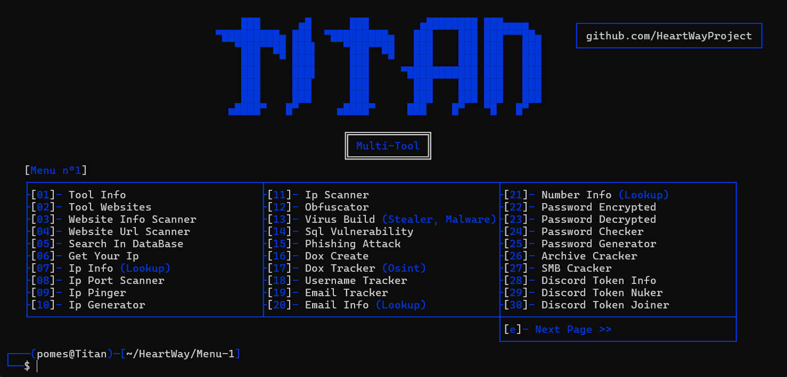

  <h3 align="center">⭐ Titan-Multitool v1.2 ⭐</h3>

	N'oubliez pas de définir le repository sur "Star" pour rester à jour !

<h1>📜・Description:</h1>

	Titan-Multitool est une boîte à outils polyvalente et puissante, conçue pour améliorer votre productivité en développement, gestion de projets, et sécurité informatique. Développée par HeartWay, cette suite d'outils vous offre 78 fonctionnalités différentes pour simplifier vos tâches quotidiennes. Que vous soyez développeur, administrateur système ou un passionné de technologie, Titan-Multitool est votre allié incontournable.

	👨‍💻 -> Développé en Python 3.12.

	🌍 -> Outil en anglais et bientôt dans une multitude d'autres langues.

	💻 -> Compatible avec Windows et bientôt Linux.

	🔎 -> Pas de malware ni de backdoor.

	📂 -> Open Source pour vérification, garantissant l'absence de programmes malveillants.

	🔄 -> Mises à jour fréquentes.

	💰 -> Gratuit pour tous.

⭐・Features:

	Titan-Multitool vous offre une large gamme de fonctionnalités réparties en différentes catégories :

⚙️・Fonctions Principales:

	Info : Informations sur l'outil et son site web.

	Parametres : Modification de l'apparence du Tool

	Obfuscation : Outil d'obfuscation.

	R.A.T Discord : Un R.A.T Discord performant et fonctionnel avec les objets disponibles a l'achat.

	Réseau : Scanners de vulnérabilité SQL, site web, IP, ports, etc.

	OSINT : Création de dox, suivi de nom d'utilisateur, email, numéro de téléphone, etc.

	Utilitaires : Attaques de phishing, décryptage de mots de passe, recherche dans une base de données, et bien d'autres.

	Virus Builder : Création de logiciels malveillants (usage éducatif uniquement).

	Discord Tools : Outils divers pour la gestion de comptes et de serveurs Discord.

	Roblox Tools : Outils pour la gestion de comptes et d'informations Roblox.

 Nouveautées de la Mise à Jour :

Traduction : *Le multitool est désormais disponible en français et en espagnol (version bêta).*

Correction du Virus Builder : *Amélioration de la sortie du virus builder pour corriger des erreurs de génération dans le mauvais répertoire.*

Amélioration du RAT Discord : *Le fonctionnement du RAT à été modifié afin de créer un nouveau fichier a la place de simplement lancer le fichier pour améliorer la discrétion du RAT.*

Amélioration de la navigation : *Utilisation des touches "e" pour passer au menu suivant et "a" pour revenir au menu précédent, facilitant ainsi la navigation au maximum.*

Prochaine mise à jour :

Amélioration de la traduction : *Perfectionnement de la traduction et personnalisation du Tool.*

Améliorations du Virus et RAT Builder :* Ajout de nouvelles fonctionnalités pour le virus builder et le rat builder.*

Nouvelles fonctionnalités : *Ajout et amélioration d'autres tools.*

🔒・Requirements:

	Windows:

	Installer Python avec les options PATH.

	Windows 10 ou supérieur.

	Linux:

	Soon

⏳・Installation:

	Téléchargez "Titan-Multitool.zip" ici.

	Décompressez le dossier.

	Lancez "Setup.bat" ou "Setup.py".

	Ou:

	Ouvrez un terminal.

	Écrivez git clone https://github.com/heartway/Titan-Multitool.git.

	Écrivez cd Titan-Multitool.

	Écrivez python Setup.py.

⚠️・Conditions d'utilisation:

	Titan-Multitool a été développé uniquement à des fins éducatives. Ce projet a été créé avec de bonnes intentions et est destiné à un usage personnel uniquement. En choisissant d'utiliser Titan-Multitool, vous reconnaissez et acceptez l'entière responsabilité des conséquences pouvant résulter de vos actions.

💰・Donation:

	Adresse Bitcoin :
	
	
	Soon

	Adresse Litecoin :
	
	
	Soon

🔗・Credits:

	Discord: https://discord.gg/CnZ4nKp2re

	Website: Heartway-commerce.odoo.com

	Creator: HeartWay

	Version: 1.0
